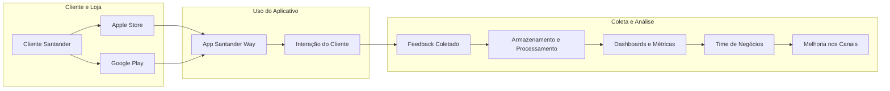

🧭 ♨️ COMPASS
---

O repositório **compass-deployment** é uma solução desenvolvida para o programa **Data Master**, organizado pela **F1rst Tecnologia**, com o objetivo de fornecer uma plataforma robusta para captura, processamento e análise de feedbacks de clientes do Banco Santander.

## 1. Objetivo do Projeto
 ---

A idealização deste case surgiu da necessidade de conectar as dores do time de negócios ao potencial da Engenharia de Dados para resolvê-las. O objetivo foi explorar como a extração, transformação e disponibilização de informações podem gerar insights valiosos sobre a experiência dos clientes do Santander ao utilizarem seus produtos e serviços. Além disso, a solução tem o potencial de analisar as dores dos clientes da concorrência, permitindo uma visão estratégica ainda mais ampla.

### 1.1 O Projeto Compass
---

O **Projeto Data Master Compass** é uma iniciativa de Engenharia de Dados projetada para capturar e analisar feedbacks de clientes sobre produtos e serviços do Banco Santander. O nome `Compass` reflete seu propósito: orientar o time de negócios na melhoria contínua de processos e produtos, com base em dados reais.

Ao coletar e interpretar avaliações dos clientes, o projeto identifica necessidades e oportunidades de aprimoramento, fortalecendo o compromisso do Santander com a satisfação e fidelização. Essa abordagem não só refina a experiência do cliente, mas também consolida o banco como referência no mercado, contribuindo para a **principalidade** — ser o banco principal de seus clientes.

A solução centraliza as informações em um **Data Lake** no HDFS, categorizando por data de referencia e segmento (PF e PJ). Isso proporciona insights valiosos para **Product Owners**, **Product Managers** e **Gerentes de Projetos**, permitindo decisões baseadas em evidências e alinhadas às necessidades reais dos clientes.

🧭 **Exemplo Prático**

Imagine uma equipe desenvolvendo uma nova funcionalidade para contas correntes, como extratos detalhados com mais de 90 dias de transações. Sem feedbacks reais, as melhorias podem ser implementadas com base em suposições internas. O Projeto Compass elimina essa incerteza, fornecendo acesso rápido às avaliações dos clientes, substituindo pesquisas demoradas e garantindo que as melhorias atendam às expectativas reais.

Agora, imagine que o Banco Santander deseja lançar um novo canal de investimentos para jovens do ensino médio. Como é um produto novo para o banco, é essencial entender como esse modelo funciona no mercado. O Projeto Compass possibilita a análise das principais reclamações e elogios dos clientes da concorrência, oferecendo insights estratégicos para um lançamento mais assertivo.

Além disso, times responsáveis por produtos como PIX, Consórcio e Contas Correntes podem monitorar continuamente a evolução de suas funcionalidades, acompanhando a satisfação dos clientes por segmento e canal, com avaliações de 1 a 5 estrelas.

Em resumo, o Projeto Compass é uma iniciativa estratégica que alinha o desenvolvimento de produtos às necessidades reais dos clientes, impulsionando a excelência operacional e aprimorando a experiência do usuário.

## 2. Arquitetura da Solução
---

A arquitetura proposta é baseada em um ambiente **on-premises**, utilizando tecnologias para armazenamento, processamento e visualização de dados. A solução é composta por várias camadas, cada uma com um papel específico no fluxo de dados.

Separando a arquitetura do Compass por compoentes, é posśivel entender que é composta por cinco componentes principais, cada um responsável por uma etapa específica do fluxo de dados:

| **Componente**          | **Descrição**                                                                 | **Versão**  |
|-------------------------|-------------------------------------------------------------------------------|---------------------------------|
| Storage Historical      | Armazenamento de dados históricos com retenção máxima de cinco anos. Utiliza Apache Hadoop para suportar grandes volumes de dados. | Apache Hadoop: 3.1.1 |
| Storage                 | Armazenamento de dados funcionais dividido em duas categorias:   - Avaliações internas dos aplicativos Santander: Alimentadas via API e canal de feedback, armazenadas no MongoDB.   - Métricas aplicacionais: Armazenadas no Elasticsearch. | MongoDB: 7    Elasticsearch: 8.16.1 |
| Processing              | Utiliza Apache Spark para processamento distribuído de dados.                 | Apache Spark 3.5.0 |
| Visualization           | Métricas técnicas: Grafana.   Métricas funcionais: Metabase. | Grafana, Metabase |
| Orchestrator            | Apache Airflow é utilizado como orquestrador principal da malha de dados do projeto. | Apache Airflow 2.7.2 |

> [!NOTE]
> O repositório da infraestrutura do Hadoop foi desenvolvida em:
> https://github.com/gacarvalho/infra-data-master-compass

## 3. Visão Geral da Arquitetura Técnica
---

Como base da arquitetura, o projeto Compass utiliza alguns recursos para realizar o processo desde a extração dos dados até a disponibilização. O ambiente onde o projeto está em execução é on-premisses e foram divididas em algumas camadas, como:

- **Arquitetura Batch**: Serviços referente a arquitetura de big data on-premisse.
  
| **Arquitetura** | **Camada**                   | **Descrição**                                                                                   | **Público alvo**        |
|-----------------|------------------------------|-------------------------------------------------------------------------------------------------|-------------------------|
| Batch           | Camada de Observabilidade     | Serviços responsáveis por coletar e monitorar dados de telemetria, fornecendo visibilidade sobre o desempenho e a integridade dos recursos das aplicações. | Time Dev, Sustentação   |
| Batch           | Camada de Business Service    | Serviços focados em análise e inteligência de negócios, fornecendo insights estratégicos para decisões organizacionais por meio de BI e relatórios analíticos. | Plataforma, Gerência    |
| Batch           | Camada de Aplicações          | Aplicações desenvolvidas em PySpark (Python), com artefatos implementados em containers, oferecendo uma abordagem escalável e modular para processamento de dados. | Time Dev                |

### 3.1 Descrição do Fluxo de Dados
---

> [!IMPORTANT]
> Descrição das collections e armazenamento estão descritos para **v1 do Projeto Compass**!

Como parte da arquitetura, vamos ter 3 divisões bases, como: Extração de dados, Transformação de Dados e Carga de Dados.

#### 3.1.1 Origens de Dados (fontes)

As coleções do MongoDB representam o armazenamento interno do Santander, utilizado para armazenar os feedbacks provenientes de diversos canais, refletindo a jornada do cliente dentro do aplicativo Santander. Essas coleções são alimentadas conforme o canal responsável por cada interação.

- **BASE INTERNA SANTANDER**:
    - `Collections (MongoDB) Santander Way`: Aplicação móvel do Santander utilizada pelos clientes.
    - `Collections (MongoDB) Santander BR`: Aplicação móvel do Santander para operações bancárias.
    - `Collections (MongoDB) Santander Select Global`: Aplicação móvel de conta em dólar do Santander.
    - `Collections (MongoDB) Outros Aplicativos Santander`: Diversos aplicativos que fornecem dados transacionais.

As APIs externas são responsáveis pela captura de dados provenientes de fontes fora do ecossistema Santander, utilizando duas APIs distintas. A SERPAPI, uma solução paga, foi escolhida como alternativa devido a uma limitação no acesso direto aos dados do Google Play. Como não somos proprietários do aplicativo Santander na plataforma, não podemos acessar essas informações diretamente. Para realizar a extração dos dados, seria necessário ser proprietário do aplicativo na Google Play Store e possuir uma conta de serviço com permissões de desenvolvedor. Diante dessa restrição, a SERPAPI foi adotada como uma solução viável.

Por outro lado, a API do iTunes está disponível sem custos, mas sua utilização requer uma liberação de firewall e a colaboração com um time responsável pela extração de dados externos do Santander. Vale destacar que, ao utilizar essa API, há uma limitação no número de avaliações que podem ser acessadas, sendo possível buscar apenas as últimas 500 avaliações.

- **EXTENO SANTANDER**:
    - `SerpApi`: API utilizada para coletar avaliações do **Google Play** (opcional).
    - `itunes.apple.com`: API utilizada para coletar avaliações da **Apple Store**.

#### 3.1.2 Camada de Processamento 

A Camada de Processamento é uma das principais responsáveis pelo tratamento e transformação dos dados dentro do projeto Compass, composta por três camadas distintas de processamento utilizando o Apache Spark. Cada camada tem um papel específico no fluxo de dados, desde a ingestão até o enriquecimento final.

- **PROCESSAMENTO**:
    - `Spark Bronze - Ingestion`: Responsável pela ingestão e pré-processamento de dados.
    - `Spark Silver`: Camada intermediária de processamento, armazenando dados históricos.
    - `Spark Gold`: Camada de agregação e enriquecimento dos dados processados.

> [!NOTE]
> A regra de negócios está detalhado no item `4. Fluxo Funcional e Jornada do Cliente`!
 
#### 3.1.3 Camada de Armazenamento

- **ARMAZENAMENTO**:
    - `MongoDB`: Banco de dados NoSQL para armazenamento estruturado para dados funcionais.

   

     
Informações Detalhada do Armazenamento: MONGODB

   
   
     | **Collection**                          | **Descrição**                                          | **Quem Alimenta**                              |
     |-----------------------------------------|--------------------------------------------------------|------------------------------------------------|
     | banco-santander-br                      | Feedbacks e avaliações do aplicativo Santander BR      | Canal                                          |
     | santander-select-global                 | Feedbacks e avaliações do aplicativo Santander Select Global            | Canal            |
     | santander-way                           | Feedbacks e avaliações do aplicativo Santander Way     | Canal                       |
     | dt_d_view_gold_agg_compass              | Camada de agregação de dados históricos e enriquecidos  |  <ul><li>Processos de agregação e análise do Compass</li> <li>  DAG: dag_d_pipeline_compass_reviews. </li> <li> JOB: GOLD_APP_GOLD_AGGREGATE_REVIEWS_SANTANDER    </li> |
     | dt_d_view_silver_historical_compass     | Camada intermediária de dados históricos               | <ul><li> Processos de pré-processamento e agregação do Compass </li> <li>  DAG: dag_d_pipeline_compass_reviews. </li> <li>  JOB: GOLD_APP_GOLD_AGGREGATE_REVIEWS_SANTANDE </li> </ul> |
   
   

   - `Hadoop`: Sistema distribuído para armazenamento e processamento de dados.

  

     
Informações Detalhada do Armazenamento: HADOOP

     
A camada Bronze armazena dados brutos coletados de diferentes fontes. Esses dados ainda não passaram por processamento ou transformação. Subdiretórios por aplicativo: `banco-santander-br_pf`, `santander-select-global_pf`, `santander-way_pf`. Abaixo está a estrutura detalhada:

 
     > Caminho Base Bronze: `/santander/bronze/compass/reviews/`
    
    
    | **Plataforma**     | **Caminho**                                       | **Subdiretórios por Aplicativo**                                                                | **Organização**                                 |
    |--------------------|---------------------------------------------------|------------------------------------------------------------------------------------------------|------------------------------------------------|
    | **Apple Store**     | `/santander/bronze/compass/reviews/appleStore/`   | <ul><li> `banco-santander-br_pf/`</li> <li>`santander-select-global_pf/`</li> <li>`santander-way_pf/`</li></ul>                     | Subdiretórios por data (`odate=YYYYMMDD`)      |
    | **Google Play**     | `/santander/bronze/compass/reviews/googlePlay/`   | <ul><li>`banco-santander-br_pf/` </li><li>`santander-select-global_pf/`</li> <li>`santander-way_pf/` </li></ul>                     | Subdiretórios por data (`odate=YYYYMMDD`)      |
    | **MongoDB**         | `/santander/bronze/compass/reviews/mongodb/`      | <ul><li>`banco-santander-br_pf/` </li><li>`santander-select-global_pf/`</li> <li>`santander-way_pf/` </li>                     | Subdiretórios por data (`odate=YYYYMMDD`)      |

    ---
    
    A camada **Silver** contém dados processados e transformados a partir da camada Bronze. Esses dados são mais estruturados e prontos para análise.
    
    > Caminho Base Silver: `/santander/silver/compass/reviews/`
    
    
    
    | **Plataforma**     | **Caminho**                                       | **Subdiretórios por Aplicativo**           | **Organização**                                 |
    |--------------------|---------------------------------------------------|--------------------------------------------|------------------------------------------------|
    | **Apple Store**     | `/santander/silver/compass/reviews/appleStore/`   | Dados processados da Apple Store.         | Subdiretórios por data (`odate=YYYYMMDD`)      |
    | **Google Play**     | `/santander/silver/compass/reviews/googlePlay/`   | Dados processados do Google Play.         | Subdiretórios por data (`odate=YYYYMMDD`)      |
    | **MongoDB**         | `/santander/silver/compass/reviews/mongodb/`      | Dados processados do MongoDB.             | Subdiretórios por data (`odate=YYYYMMDD`)      |
    | **Falhas**          | `/santander/silver/compass/reviews_fail/`         | Dados que falharam no processamento.      | Subdiretórios por data (`odate=YYYYMMDD`)      |
    
    ---
    
    A camada **Gold** contém dados agregados e prontos para consumo final. Esses dados são utilizados para geração de relatórios, dashboards e análises avançadas.
    > Caminho Base Gold: `/santander/gold/compass/reviews/`
    
    | **Tipo de Dado**          | **Caminho**                                       | **Descrição**                                                                                   | **Organização**                                 |
    |---------------------------|---------------------------------------------------|------------------------------------------------------------------------------------------------|------------------------------------------------|
    | **Agregação de Reviews**  | `/santander/gold/compass/reviews/apps_santander_aggregate/` | Dados agregados dos aplicativos do Santander.                                                  | Subdiretórios por data (`odate=YYYYMMDD`)      |
    | **Falhas no Processamento** | `/santander/gold/compass/reviews_fail/`           | Dados que falharam no processamento final.                                                     | Subdiretórios por data (`odate=YYYYMMDD`)      |
    
    ---
    
    
    A camada **Quality** contém dados relacionados à qualidade dos dados, como padrões de validação e métricas de qualidade.
    > Caminho Base Quality: `/santander/quality/compass/reviews/`
    
    | **Tipo de Dado**          | **Caminho**                                       | **Descrição**                                                                                   | **Organização**                                 |
    |---------------------------|---------------------------------------------------|------------------------------------------------------------------------------------------------|------------------------------------------------|
    | **Padrões de Validação**  | `/santander/quality/compass/reviews/pattern/`     | Padrões de validação aplicados aos dados.                                                      | Subdiretórios por plataforma (ex: `pattern/`, `schema/`) |
    
   
   

   - `Elasticsearch`: O **Elasticsearch** é usado para indexação e busca de dados técnicos. Abaixo estão os índices disponíveis, com seus objetivos e responsáveis pela ingestão dos dados.

   

      
Informações Detalhada do Armazenamento: ELASTICSEARCH

    
    
     | **Índice**                         | **Objetivo**                                  | **Quem Alimenta** |
     |-------------------------------------|-----------------------------------------------|-------------------|
     | **compass_dt_datametrics**          | Dados técnicos de métricas de performance     | <ul><li> DAG: `dag_d_pipeline_compass_review` </li> <li>JOB: Todos JOBS SPARK (group_ingestion, group_jobs_silver, group_jobs_gold)</li></ul> |
     | **compass_dt_datametrics_fail**     | Dados de falhas nas métricas de performance   | <ul><li> DAG: `dag_d_pipeline_compass_reviews` </li> <li> JOB: Todos JOBS SPARK (group_ingestion, group_jobs_silver, group_jobs_gold) </li></ul> |
    
   

#### 3.1.4 Camada de Visualização e Telemetria (monitação)

- `Metabase`: Ferramenta de Business Intelligence (BI) para análise de dados.
  

     
Informações Detalhada do Dashboard: METABASE 

     O Metabase é uma ferramenta de Business Intelligence (BI) que permite a análise de dados de forma intuitiva e visual. Ele facilita a criação de dashboards interativos e relatórios sem a necessidade de conhecimento avançado em queries.

     - **Objetivo do Metabase:**  O principal objetivo do Metabase é fornecer uma interface amigável para que usuários de negócio possam acessar, visualizar e analisar dados sem dependência de equipes técnicas. Ele permite a tomada de decisões baseada em dados de forma ágil e eficiente.

     - **Por que utilizar o Metabase?** 
         - Interface intuitiva: Não requer conhecimento avançado em queries.
         - Open-source e extensível: Pode ser personalizado conforme necessidade.
         - Integração com diversas fontes de dados: Suporte para bancos SQL e NoSQL.
         - Criação rápida de dashboards: Permite visualizar KPIs e métricas facilmente.
         - Automatização de relatórios: Geração automática de relatórios e alertas por e-mail.       

     - **Dashboards  (link de acesso):** Os dashboards criados no Metabase fornecem uma visão detalhada dos principais indicadores e métricas da organização.
 
     | **Categoria**                     | **Métricas**             | **Ambiente** | **Link de acesso**
     |-----------------------------------|--------------------------|--------------|----------------------
     | Observabilidade Aplicação         | Aplicação (negócio)      | Pro-Produção | [Dashboard Compass - PRO - Data - Metabase](http://00.000.000.00:8085/setup)

  - **Metodologia e boas práticas:** Utilizndo as boas práticas, o dashboard foi dividido em 3 visões: (1) visão gerencial, (2) visão macro por ano-mes e (3) visão granular.

    A visão (1) é dedicada para a visão gerencial estruturado com visões gráficas estraturada em:

      - Média da experiência do cliente atual
      - Segmentação do(s) canais Santander PF e PJ 
      - Nota média do(s) aplicativos Santander - histórico
      - Volumetria de avaliações dos apps Santander - total
      - Volume por canais e segmento
      - Volumetria de avaliações nos canais Santander por ano-mes
      - Volume por origem extração e segmento
      - Volumetria de avaliações dos canais Santander por origem

    Já a visão (2) é dedicada para a visão macro gerencial estruturado em tabela com visões das seguintes informações:

      - App nome
      - App Source
      - Periodo Referencia
      - Segmento
      - Nota Média
      - Avaliações Totais
      - Comentários Positivos
      - Comentários Negativos

    E a visão (3) já é com a menor granularidade, sendo os eventos de feedbacks dos clientes, estruturado em tabela nas seguintes visões:
  
      - Titulo
      - Snippet (conteúdo da avaliação)
      - App Source
      - App
      - Segmento
      - Nota
      - Timestamp da avaliação
      - Periodo Rereferencia 
  - **Tabela de métricas utilizadas:**
 
    | **Componente**              | **Categoria**            | Visão | **Tipo de Painel**        | **Nome da métrica**                         | **Unidade**  | **Descrição** | **Query Metrica** |
    |-----------------------------|--------------------------|-------|-------------------|---------------------------------------------|--------------|---------------|----------------------
    | Nota média das avaliações   | Indicador                | Display: Progresso  | Dashboard     | Média da experiência do cliente atual       | 1 a 5        | Nota média das avaliações dos clientes de 1 a 5 de acordo filtro selecionado| `[ {"$sort":{"periodo_referencia":-1}}, {"$project":{"app_nome":"$app_nome","app_source":"$app_source","periodo_referencia":"$periodo_referencia","nota_media":{"$round":["$nota_media",0]},"avaliacoes_total":"$avaliacoes_total","comentarios_positivos":"$comentarios_positivos","comentarios_negativos":"$comentarios_negativos","segmento":"$segmento"}}, {"$limit":1048575}, {"$match":{"$and":[{"nota_media":{"$gte":1}},{"nota_media":{"$lte":5}}]}}, {"$sort":{"periodo_referencia":1,"app_nome":1,"app_source":1}}, {"$project":{"_id":"$_id","app_nome":"$app_nome","app_source":"$app_source","periodo_referencia":"$periodo_referencia","nota_media":"$nota_media","avaliacoes_total":"$avaliacoes_total","comentarios_positivos":"$comentarios_positivos","comentarios_negativos":"$comentarios_negativos","segmento":"$segmento"}}, {"$limit":1048575}, {"$match":{"$and":[{"nota_media":{"$gte":1}},{"nota_media":{"$lte":5}}]}}, {"$group":{"_id":{"periodo_referencia":"$periodo_referencia","segmento":"$segmento"},"avg_nota_media":{"$avg":"$nota_media"},"app_nome":{"$first":"$app_nome"},"app_source":{"$first":"$app_source"}}}, {"$sort":{"_id":1}}, {"$project":{"_id":false,"periodo_referencia":"$_id.periodo_referencia","segmento":"$_id.segmento","avg":"$avg_nota_media","app_nome":1,"app_source":1}}, { "$match": { "$expr": { "$eq": [ "$periodo_referencia", { "$max": "$periodo_referencia" } ] } } }, { "$sort": { "periodo_referencia": -1 } }, { "$project": { "_id": false, "avg": "$avg" } }, { "$limit": 1 } ]`
    | Volumetria de reclamações por segmento   | Indicador   | Display: Pizza  |Dashboard     | Segmentação do(s) canais Santander - PF e PJ ~| PF, PJ + volumetria        | Volumetria de reclamações por segmento x volumetria + porcentagem | `[ {"$sort":{"periodo_referencia":-1}}, {"$project":{"app_nome":"$app_nome","app_source":"$app_source","periodo_referencia":"$periodo_referencia","nota_media":{"$round":["$nota_media",0]},"avaliacoes_total":"$avaliacoes_total","comentarios_positivos":"$comentarios_positivos","comentarios_negativos":"$comentarios_negativos","segmento":"$segmento"}}, {"$limit":1048575}, {"$match":{"$and":[{"nota_media":{"$gte":1}},{"nota_media":{"$lte":5}}]}}, {"$sort":{"periodo_referencia":1,"app_nome":1,"app_source":1}}, {"$project":{"_id":"$_id","app_nome":"$app_nome","app_source":"$app_source","periodo_referencia":"$periodo_referencia","nota_media":"$nota_media","avaliacoes_total":"$avaliacoes_total","comentarios_positivos":"$comentarios_positivos","comentarios_negativos":"$comentarios_negativos","segmento":"$segmento"}}, {"$limit":1048575}, {"$match":{"$and":[{"nota_media":{"$gte":1}},{"nota_media":{"$lte":5}}]}}, {"$group":{"_id":{"periodo_referencia":"$periodo_referencia","segmento":"$segmento"},"avg_nota_media":{"$avg":"$nota_media"},"app_nome":{"$first":"$app_nome"},"app_source":{"$first":"$app_source"}}}, {"$sort":{"_id":1}}, {"$project":{"_id":false,"periodo_referencia":"$_id.periodo_referencia","segmento":"$_id.segmento","avg":"$avg_nota_media","app_nome":1,"app_source":1}}, { "$match": { "$and": [ { "$and": [ { "avg": { "$gte": 1 } }, { "avg": { "$lte": 5 } } ] }, { "$or": [ { "segmento": "PF" }, { "segmento": "PJ" } ] } ] } }, { "$sort": { "periodo_referencia": -1 } }, { "$project": { "_id": false, "periodo_referencia": "$periodo_referencia", "segmento": "$segmento", "avg": "$avg", "app_nome": "$app_nome", "app_source": "$app_source" } }, { "$limit": 1048575 } ]`
    | Nota média dos aplicativos Santander por ano mês   | Indicador   | Display: Barra  |Dashboard     | Nota média do(s) aplicativos Santander - historico ~| Média da nota por ano mês       | Nota relação aplicativos Santader por ano mês de acordo filtro selecionado| `[ {"$sort":{"periodo_referencia":-1}}, {"$project":{"app_nome":"$app_nome","app_source":"$app_source","periodo_referencia":"$periodo_referencia","nota_media":{"$round":["$nota_media",0]},"avaliacoes_total":"$avaliacoes_total","comentarios_positivos":"$comentarios_positivos","comentarios_negativos":"$comentarios_negativos","segmento":"$segmento"}}, {"$limit":1048575}, {"$match":{"$and":[{"nota_media":{"$gte":1}},{"nota_media":{"$lte":5}}]}}, {"$sort":{"periodo_referencia":1,"app_nome":1,"app_source":1}}, {"$project":{"_id":"$_id","app_nome":"$app_nome","app_source":"$app_source","periodo_referencia":"$periodo_referencia","nota_media":"$nota_media","avaliacoes_total":"$avaliacoes_total","comentarios_positivos":"$comentarios_positivos","comentarios_negativos":"$comentarios_negativos","segmento":"$segmento"}}, {"$limit":1048575}, {"$match":{"$and":[{"nota_media":{"$gte":1}},{"nota_media":{"$lte":5}}]}}, {"$group":{"_id":{"periodo_referencia":"$periodo_referencia","segmento":"$segmento"},"avg_nota_media":{"$avg":"$nota_media"},"app_nome":{"$first":"$app_nome"},"app_source":{"$first":"$app_source"}}}, {"$sort":{"_id":1}}, {"$project":{"_id":false,"periodo_referencia":"$_id.periodo_referencia","segmento":"$_id.segmento","avg":"$avg_nota_media","app_nome":1,"app_source":1}}, { "$match": { "$and": [ { "avg": { "$gte": 1 } }, { "avg": { "$lte": 5 } } ] } }, { "$sort": { "periodo_referencia": -1 } }, { "$project": { "_id": false, "periodo_referencia": "$periodo_referencia", "segmento": "$segmento", "avg": "$avg", "app_nome": "$app_nome", "app_source": "$app_source" } }, { "$limit": 1048575 } ]`
    | Volumetria de avaliações totais   | Indicador   | Display: Indicador  |Dashboard     | Volumetria de avaliações dos apps Santander total ~ | Volumetria totais de avaliações      | Volumetria totais de avaliações de acordo filtro selecionado| `[ {"$sort":{"periodo_referencia":1}}, {"$project":{"_id":"$_id","app_nome":"$app_nome","app_source":"$app_source","periodo_referencia":"$periodo_referencia","nota_media":"$nota_media","nota_tendencia":"$nota_tendencia","avaliacoes_total":"$avaliacoes_total","comentarios_positivos":"$comentarios_positivos","comentarios_negativos":"$comentarios_negativos","segmento":"$segmento"}}, {"$limit":1048575}, {"$match":{"$and":[{"nota_media":{"$gte":1}},{"nota_media":{"$lte":5}}]}}, {"$sort":{"periodo_referencia":-1}}, {"$project":{"_id":"$_id","app_nome":"$app_nome","app_source":"$app_source","periodo_referencia":"$periodo_referencia","nota_media":"$nota_media","nota_tendencia":"$nota_tendencia","avaliacoes_total":"$avaliacoes_total","comentarios_positivos":"$comentarios_positivos","comentarios_negativos":"$comentarios_negativos","segmento":"$segmento"}}, {"$limit":1048575}, {"$group":{"_id":{"periodo_referencia":"$periodo_referencia","segmento":"$segmento","app_nome":"$app_nome","app_source":"$app_source"},"avg_nota_media":{"$avg":"$nota_media"},"avg_nota_tendencia":{"$avg":"$nota_tendencia"},"total_avaliacoes":{"$sum":"$avaliacoes_total"}}}, {"$sort":{"_id":1}}, {"$project":{"_id":false,"periodo_referencia":"$_id.periodo_referencia","segmento":"$_id.segmento","app_nome":"$_id.app_nome","app_source":"$_id.app_source","avg_nota_media":"$avg_nota_media","avg_nota_tendencia":"$avg_nota_tendencia","total_avaliacoes":"$total_avaliacoes"}}, { "$group": { "_id": null, "sum": { "$sum": "$total_avaliacoes" } } }, { "$sort": { "_id": 1 } }, { "$project": { "_id": false, "sum": true } } ]`
    | Volumetria de avaliações totais agregados por canais e segmento   | Indicador   | Display: Pizza  |Dashboard     | Volume por canais e segmento ~ | Volumetria totais de avaliações agregado por cenais e segmento    | Volumetria totais de avaliações agregado de acordo filtro selecionado | `[ {"$sort":{"periodo_referencia":1}}, {"$project":{"_id":"$_id","app_nome":"$app_nome","app_source":"$app_source","periodo_referencia":"$periodo_referencia","nota_media":"$nota_media","nota_tendencia":"$nota_tendencia","avaliacoes_total":"$avaliacoes_total","comentarios_positivos":"$comentarios_positivos","comentarios_negativos":"$comentarios_negativos","segmento":"$segmento"}}, {"$limit":1048575}, {"$match":{"$and":[{"nota_media":{"$gte":1}},{"nota_media":{"$lte":5}}]}}, {"$sort":{"periodo_referencia":-1}}, {"$project":{"_id":"$_id","app_nome":"$app_nome","app_source":"$app_source","periodo_referencia":"$periodo_referencia","nota_media":"$nota_media","nota_tendencia":"$nota_tendencia","avaliacoes_total":"$avaliacoes_total","comentarios_positivos":"$comentarios_positivos","comentarios_negativos":"$comentarios_negativos","segmento":"$segmento"}}, {"$limit":1048575}, {"$group":{"_id":{"periodo_referencia":"$periodo_referencia","segmento":"$segmento","app_nome":"$app_nome","app_source":"$app_source"},"avg_nota_media":{"$avg":"$nota_media"},"avg_nota_tendencia":{"$avg":"$nota_tendencia"},"total_avaliacoes":{"$sum":"$avaliacoes_total"}}}, {"$sort":{"_id":1}}, {"$project":{"_id":false,"periodo_referencia":"$_id.periodo_referencia","segmento":"$_id.segmento","app_nome":"$_id.app_nome","app_source":"$_id.app_source","avg_nota_media":"$avg_nota_media","avg_nota_tendencia":"$avg_nota_tendencia","total_avaliacoes":"$total_avaliacoes"}}, { "$sort": { "periodo_referencia": -1 } }, { "$project": { "_id": false, "periodo_referencia": "$periodo_referencia", "segmento": "$segmento", "app_nome": "$app_nome", "app_source": "$app_source", "total_avaliacoes": "$total_avaliacoes" } }, { "$limit": 1048575 } ]`
    | Volumetria de avaliações totais agregados por canais e segmento   | Indicador   | Display: Barra  |Dashboard     | Volumetria de avaliações nos Canais Santander por ano-mes ~ | Volumetria totais de avaliações agregado por cenais e segmento    | Volumetria totais de avaliações agregado de acordo filtro selecionado selecionado | `[ {"$sort":{"periodo_referencia":1}}, {"$project":{"_id":"$_id","app_nome":"$app_nome","app_source":"$app_source","periodo_referencia":"$periodo_referencia","nota_media":"$nota_media","nota_tendencia":"$nota_tendencia","avaliacoes_total":"$avaliacoes_total","comentarios_positivos":"$comentarios_positivos","comentarios_negativos":"$comentarios_negativos","segmento":"$segmento"}}, {"$limit":1048575}, {"$match":{"$and":[{"nota_media":{"$gte":1}},{"nota_media":{"$lte":5}}]}}, {"$sort":{"periodo_referencia":-1}}, {"$project":{"_id":"$_id","app_nome":"$app_nome","app_source":"$app_source","periodo_referencia":"$periodo_referencia","nota_media":"$nota_media","nota_tendencia":"$nota_tendencia","avaliacoes_total":"$avaliacoes_total","comentarios_positivos":"$comentarios_positivos","comentarios_negativos":"$comentarios_negativos","segmento":"$segmento"}}, {"$limit":1048575}, {"$group":{"_id":{"periodo_referencia":"$periodo_referencia","segmento":"$segmento","app_nome":"$app_nome","app_source":"$app_source"},"avg_nota_media":{"$avg":"$nota_media"},"avg_nota_tendencia":{"$avg":"$nota_tendencia"},"total_avaliacoes":{"$sum":"$avaliacoes_total"}}}, {"$sort":{"_id":1}}, {"$project":{"_id":false,"periodo_referencia":"$_id.periodo_referencia","segmento":"$_id.segmento","app_nome":"$_id.app_nome","app_source":"$_id.app_source","avg_nota_media":"$avg_nota_media","avg_nota_tendencia":"$avg_nota_tendencia","total_avaliacoes":"$total_avaliacoes"}}, { "$sort": { "periodo_referencia": -1 } }, { "$project": { "_id": false, "periodo_referencia": "$periodo_referencia", "segmento": "$segmento", "app_nome": "$app_nome", "app_source": "$app_source", "total_avaliacoes": "$total_avaliacoes" } }, { "$limit": 1048575 } ]`
     | Volumetria agregada por origem de extração e segmento PF/PJ   | Indicador   | Display: Pizza  |Dashboard     | Volume por Origem Extracao e Segmento ~ | Volumetria agregada por origem e segmento dos clientes    | Volumetria agregada por origem e segmento de acordo filtro selecionado | `[ {"$sort":{"periodo_referencia":1}}, {"$project":{"_id":"$_id","app_nome":"$app_nome","app_source":"$app_source","periodo_referencia":"$periodo_referencia","nota_media":"$nota_media","nota_tendencia":"$nota_tendencia","avaliacoes_total":"$avaliacoes_total","comentarios_positivos":"$comentarios_positivos","comentarios_negativos":"$comentarios_negativos","segmento":"$segmento"}}, {"$limit":1048575}, {"$match":{"$and":[{"nota_media":{"$gte":1}},{"nota_media":{"$lte":5}}]}}, {"$sort":{"periodo_referencia":-1}}, {"$project":{"_id":"$_id","app_nome":"$app_nome","app_source":"$app_source","periodo_referencia":"$periodo_referencia","nota_media":"$nota_media","nota_tendencia":"$nota_tendencia","avaliacoes_total":"$avaliacoes_total","comentarios_positivos":"$comentarios_positivos","comentarios_negativos":"$comentarios_negativos","segmento":"$segmento"}}, {"$limit":1048575}, {"$group":{"_id":{"periodo_referencia":"$periodo_referencia","segmento":"$segmento","app_nome":"$app_nome","app_source":"$app_source"},"avg_nota_media":{"$avg":"$nota_media"},"avg_nota_tendencia":{"$avg":"$nota_tendencia"},"total_avaliacoes":{"$sum":"$avaliacoes_total"}}}, {"$sort":{"_id":1}}, {"$project":{"_id":false,"periodo_referencia":"$_id.periodo_referencia","segmento":"$_id.segmento","app_nome":"$_id.app_nome","app_source":"$_id.app_source","avg_nota_media":"$avg_nota_media","avg_nota_tendencia":"$avg_nota_tendencia","total_avaliacoes":"$total_avaliacoes"}}, { "$sort": { "periodo_referencia": -1 } }, { "$project": { "_id": false, "periodo_referencia": "$periodo_referencia", "segmento": "$segmento", "app_nome": "$app_nome", "app_source": "$app_source", "total_avaliacoes": "$total_avaliacoes" } }, { "$limit": 1048575 } ]`
    | Volumetria agregada por canais vs origem   | Indicador   | Display: Linha  |Dashboard     | Volumetria de avaliações dos Canais Santander por Origem ~ | Volumetria agregada por canal e origem de extração   | Volumetria agregada por canal e origem de acordo com filtro selecionado | `[ {"$sort":{"periodo_referencia":1}}, {"$project":{"_id":"$_id","app_nome":"$app_nome","app_source":"$app_source","periodo_referencia":"$periodo_referencia","nota_media":"$nota_media","nota_tendencia":"$nota_tendencia","avaliacoes_total":"$avaliacoes_total","comentarios_positivos":"$comentarios_positivos","comentarios_negativos":"$comentarios_negativos","segmento":"$segmento"}}, {"$limit":1048575}, {"$match":{"$and":[{"nota_media":{"$gte":1}},{"nota_media":{"$lte":5}}]}}, {"$sort":{"periodo_referencia":-1}}, {"$project":{"_id":"$_id","app_nome":"$app_nome","app_source":"$app_source","periodo_referencia":"$periodo_referencia","nota_media":"$nota_media","nota_tendencia":"$nota_tendencia","avaliacoes_total":"$avaliacoes_total","comentarios_positivos":"$comentarios_positivos","comentarios_negativos":"$comentarios_negativos","segmento":"$segmento"}}, {"$limit":1048575}, {"$group":{"_id":{"periodo_referencia":"$periodo_referencia","segmento":"$segmento","app_nome":"$app_nome","app_source":"$app_source"},"avg_nota_media":{"$avg":"$nota_media"},"avg_nota_tendencia":{"$avg":"$nota_tendencia"},"total_avaliacoes":{"$sum":"$avaliacoes_total"}}}, {"$sort":{"_id":1}}, {"$project":{"_id":false,"periodo_referencia":"$_id.periodo_referencia","segmento":"$_id.segmento","app_nome":"$_id.app_nome","app_source":"$_id.app_source","avg_nota_media":"$avg_nota_media","avg_nota_tendencia":"$avg_nota_tendencia","total_avaliacoes":"$total_avaliacoes"}}, {"$project":{"_id":false,"periodo_referencia":"$periodo_referencia","segmento":"$segmento","app_nome":"$app_nome","app_source":"$app_source","avg_nota_media":"$avg_nota_media","avg_nota_tendencia":"$avg_nota_tendencia","total_avaliacoes":"$total_avaliacoes"}}, {"$limit":1048575}, { "$sort": { "periodo_referencia": -1, "app_source": 1 } }, { "$project": { "_id": false, "periodo_referencia": "$periodo_referencia", "segmento": "$segmento", "app_nome": "$app_nome", "app_source": "$app_source", "avg_nota_media": "$avg_nota_media", "avg_nota_tendencia": "$avg_nota_tendencia", "total_avaliacoes": "$total_avaliacoes" } }, { "$limit": 1048575 } ]`
    | Visão agregada (macro) por Fonte, Canal e Segmento   | Tabela Agregada   | Display: Tabela  |Agregada     | Dt D View Gold Agg Compass ~ | Agregada por ano mês, segmento e nota médoa.   | Visão agregada por Fonte de Origem, Canais, Segmento (PF, PJ) e quebrado por nota média, avaliações totais, comentários positivos e comentários negativos. | `[ { "$project": { "_id": "$_id", "app_nome": "$app_nome", "app_source": "$app_source", "periodo_referencia": "$periodo_referencia", "segmento": "$segmento", "nota_media": "$nota_media", "avaliacoes_total": "$avaliacoes_total", "comentarios_positivos": "$comentarios_positivos", "comentarios_negativos": "$comentarios_negativos" } }, { "$limit": 1048575 } ]`
     
     

  

   
- `Grafana`: Plataforma para monitoramento e visualização de métricas operacionais.
  

     
Informações Detalhada do Dashboard: GRAFANA 

     | **Categoria**                     | **Métricas**             | **Ambiente** | **Link de acesso**
     |-----------------------------------|--------------------------|--------------|----------------------
     | Observabilidade Aplicação         | Aplicação (negócio)      | Pré-Produção | 
     | Observabilidade Aplicação         | Aplicação (negócio)      | Pro-Produção | [Dashboard Compass - PRO - Data - Metabase](http://00.000.000.00:4000/d/aef6eps590mpsb/compass-comece-aqui?orgId=1&from=now-6h&to=now&timezone=browser&kiosk)

  
  

### 3.2 Aspectos Técnicos do Projeto Compass
---
Nesta seção, será apresentada a arquitetura técnica do Projeto Compass, detalhando seu funcionamento desde a infraestrutura até a camada aplicacional. O objetivo é fornecer uma visão abrangente do que está sendo executado, como os processos acontecem e as razões por trás das escolhas feitas, garantindo uma compreensão clara sobre a operação e a arquitetura do sistema.

## 4. Fluxo Funcional e Jornada do Cliente

A solução foi projetada para atender ao time de negócios do Santander, proporcionando uma visão estratégica das principais dores dos clientes e da concorrência. Ela permite análises em diferentes níveis de granularidade, desde indicadores agregados, como a distribuição das avaliações e notas (de 0 a 5) por segmento e canal, até um nível mais detalhado, possibilitando o acompanhamento do histórico de avaliações de clientes específicos dentro de um determinado segmento. 

📌 Fluxo Funcional:

📌 Conceito base de regra de negócio:

  

  
Regra de Negócio: Ingestão (fonte destino: bronze) 

  
  Este é o conteúdo que estará escondido até que o usuário clique para expandir.

  Você pode adicionar mais informações aqui, como texto, listas ou imagens.

  - Item 1
  - Item 2
  - Item 3

## 5. Compass como produto analytics Santander

O projeto Compass como Produto tem como objetivo fornecer uma solução robusta e escalável para o Santander, utilizando Engenharia de Dados para desenvolver um fluxo que permita identificar as principais necessidades e desafios dos seus clientes. Esse fluxo busca não apenas atender as demandas internas do banco, mas também possui o potencial de expandir sua abrangência, permitindo escalar a busca para entender as "dores" dos concorrentes do Santander no mercado.

🧭 Dashboard Funcional - Gerência

🧭 Dashboard Técnico - Aplicações e Dashboard Técnico - Sustentação  

  
  

## 6. Instruções para Configuração e Execução do Projeto Compass

## 7. Melhorias do projeto e Considerações Finais

---

