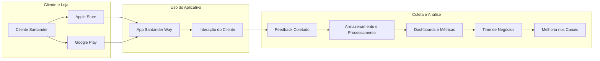
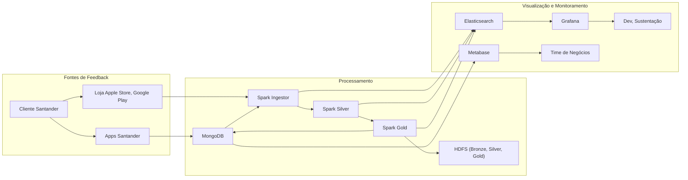

🧭 ♨️ COMPASS
---

O repositório **compass-deployment** é uma solução desenvolvida para o programa **Data Master**, organizado pela **F1rst Tecnologia**, com o objetivo de fornecer uma plataforma robusta para captura, processamento e análise de feedbacks de clientes do Banco Santander.

## 1. Objetivo do Projeto
 ---
O **Projeto Data Master Compass** é uma iniciativa de Engenharia de Dados projetada para capturar e analisar feedbacks de clientes sobre produtos e serviços do Banco Santander. O nome **Compass** reflete seu propósito: orientar o time de negócios na melhoria contínua de processos e produtos, com base em dados reais.

Ao coletar e interpretar avaliações dos clientes, o projeto identifica necessidades e oportunidades de aprimoramento, fortalecendo o compromisso do Santander com a satisfação e fidelização. Essa abordagem não só refina a experiência do cliente, mas também consolida o banco como referência no mercado, contribuindo para a **principalidade** — ser o banco principal de seus clientes.

A solução centraliza as informações em um **Data Lake** no HDFS, categorizando por data de referencia e segmento (PF e PJ). Isso proporciona insights valiosos para **Product Owners**, **Product Managers** e **Gerentes de Projetos**, permitindo decisões baseadas em evidências e alinhadas às necessidades reais dos clientes.

### 🧭 Exemplo Prático

Imagine uma equipe desenvolvendo uma nova funcionalidade para contas correntes, como extratos detalhados com mais de 90 dias de transações. Sem feedbacks reais, a equipe pode implementar melhorias baseadas em suposições internas. O **Compass** resolve isso, fornecendo acesso rápido a avaliações dos clientes, eliminando a necessidade de pesquisas demoradas e garantindo que as melhorias atendam às expectativas reais.

Em resumo, o Projeto Compass é uma iniciativa estratégica que alinha desenvolvimento de produtos às necessidades dos clientes, impulsionando a excelência operacional a experiência do usuário.

## 2. Arquitetura da Solução
---

A arquitetura proposta é baseada em um ambiente **on-premises**, utilizando tecnologias modernas para armazenamento, processamento e visualização de dados. A solução é composta por várias camadas, cada uma com um papel específico no fluxo de dados.

Separando a arquitetura do Compass por compoentes, é posśivel entender que é composta por cinco componentes principais, cada um responsável por uma etapa específica do fluxo de dados:

| **Componente**         | **Descrição**                                                                 |
|-------------------------|-------------------------------------------------------------------------------|
| Storage Historical      | Armazenamento de dados históricos com retenção máxima de cinco anos. Utiliza Apache Hadoop para suportar grandes volumes de dados. |
| Storage                 | Armazenamento de dados funcionais dividido em duas categorias:   - Avaliações internas dos aplicativos Santander: Alimentadas via API e canal de feedback, armazenadas no MongoDB (versão 7).   - Métricas aplicacionais: Armazenadas no Elasticsearch (versão 8.16.1). |
| Processing              | Utiliza Apache Spark para processamento distribuído de dados.                 |
| Visualization           | Métricas técnicas: Visualizadas em dashboards no Grafana Cloud.   Métricas funcionais: Analisadas no Metabase. |
| Orchestrator            | Apache Airflow é utilizado como orquestrador principal da malha de dados do projeto. |

> [!NOTE]
> O repositório da infraestrutura do Hadoop segue no link:
> https://github.com/gacarvalho/infra-data-master-compass

### 2.1 Visão Geral da Arquitetura Técnica
---

#### 2.1.1 Origens de Dados (extração)

- **BASE INTERNA SANTANDER**:
    - `Collections (MongoDB) Santander Way`: Aplicação móvel do Santander utilizada pelos clientes.
    - `Collections (MongoDB) Santander BR`: Aplicação móvel do Santander para operações bancárias.
    - `Collections (MongoDB) Santander Select Global`: Aplicação móvel de conta em dólar do Santander.
    - `Collections (MongoDB) Outros Aplicativos Santander`: Diversos aplicativos que fornecem dados transacionais.
    
- **EXTENO SANTANDER**:
    - `SerpApi`: API utilizada para coletar avaliações do **Google Play**.
    - `itunes.apple.com`: API utilizada para coletar avaliações da **Apple Store**.

#### 2.1.2 Camada de Processamento e Armazenamento (transformação e carga)

- **ARMAZENAMENTO**:
    - `MongoDB`: Banco de dados NoSQL para armazenamento estruturado para dados funcionais.
    - `Hadoop`: Sistema distribuído para armazenamento e processamento de dados.
    - `Elasticsearch`: Banco de dados NoSQL voltado para indexação e busca de dados para dados técnicos.
      
- **PROCESSAMENTO**:
    - `Spark Bronze - Ingestion`: Responsável pela ingestão e pré-processamento de dados.
    - `Spark Silver`: Camada intermediária de processamento, armazenando dados históricos.
    - `Spark Gold`: Camada de agregação e enriquecimento dos dados processados.

#### 2.1.3 Camada de Visualização e Monitoramento (monitação)

- `Metabase`: Ferramenta de Business Intelligence (BI) para análise de dados.
- `Grafana`: Plataforma para monitoramento e visualização de métricas operacionais.

## 3. Arquitetura Geral da Arquitetura Funcional e Jornada do Cliente

A solução foi projetada para atender ao time de negócios do Santander, proporcionando uma visão estratégica das principais dores dos clientes e da concorrência. Ela permite análises em diferentes níveis de granularidade, desde indicadores agregados, como a distribuição das avaliações e notas (de 0 a 5) por segmento e canal, até um nível mais detalhado, possibilitando o acompanhamento do histórico de avaliações de clientes específicos dentro de um determinado segmento. 

📌 Fluxo Funcional:

📌 Fluxo Técnico:

## 4. Compass como produto analytics Santander

O projeto Compass como Produto tem como objetivo fornecer uma solução robusta e escalável para o Santander, utilizando Engenharia de Dados para desenvolver um fluxo que permita identificar as principais necessidades e desafios dos seus clientes. Esse fluxo busca não apenas atender as demandas internas do banco, mas também possui o potencial de expandir sua abrangência, permitindo escalar a busca para entender as "dores" dos concorrentes do Santander no mercado.

🧭 Dashboard Funcional - Gerência

🧭 Dashboard Técnico - Aplicações

🧭 Dashboard Técnico - Sustentação

## 5. Aspectos técnicos do Projeto Compass

## 6. Instruções para Configuração e Execução do Projeto Compass

## 7. Melhorias do projeto e Considerações Finais

---

