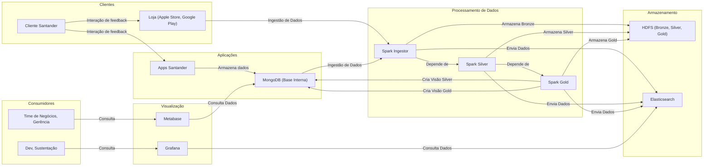

🧭 ♨️ COMPASS
---

O repositório **compass-deployment** é uma solução desenvolvida para o programa **Data Master**, organizado pela **F1rst Tecnologia**, com o objetivo de fornecer uma plataforma robusta para captura, processamento e análise de feedbacks de clientes do Banco Santander.

---

## 1. Objetivo do Projeto

O **Projeto Data Master Compass** é uma iniciativa de Engenharia de Dados projetada para capturar e analisar feedbacks de clientes sobre produtos e serviços do Banco Santander. O nome **Compass** reflete seu propósito: orientar o time de negócios na melhoria contínua de processos e produtos, com base em dados reais.

Ao coletar e interpretar avaliações dos clientes, o projeto identifica necessidades e oportunidades de aprimoramento, fortalecendo o compromisso do Santander com a satisfação e fidelização. Essa abordagem não só refina a experiência do cliente, mas também consolida o banco como referência no mercado, contribuindo para a **principalidade** — ser o banco principal de seus clientes.

A solução centraliza as informações em um **data lake**, categorizando e segmentando os dados por origem. Isso proporciona insights valiosos para **Product Owners**, **Product Managers** e **Gerentes de Projetos**, permitindo decisões baseadas em evidências e alinhadas às necessidades reais dos clientes.

### 🧭 Exemplo Prático

Imagine uma equipe desenvolvendo uma nova funcionalidade para contas correntes, como extratos detalhados com mais de 90 dias de transações. Sem feedbacks reais, a equipe pode implementar melhorias baseadas em suposições internas. O **Compass** resolve isso, fornecendo acesso rápido a avaliações dos clientes, eliminando a necessidade de pesquisas demoradas e garantindo que as melhorias atendam às expectativas reais.

Em resumo, o Projeto Compass é uma iniciativa estratégica que alinha desenvolvimento de produtos às necessidades dos clientes, impulsionando a excelência operacional a experiência do usuário.

---

## 2. Arquitetura da Solução

### 2.1 Visão Geral da Arquitetura

A arquitetura proposta é baseada em um ambiente **on-premises**, utilizando tecnologias modernas para armazenamento, processamento e visualização de dados. A solução é composta por várias camadas, cada uma com um papel específico no fluxo de dados.

#### 2.2.1 Origens de Dados

- **Santander Way**: Aplicação móvel do Santander utilizada pelos clientes.
- **Santander BR**: Plataforma do Santander para operações bancárias.
- **Santander Select Global**: Aplicação voltada para clientes premium do Santander.
- **Outros Aplicativos Santander**: Diversos aplicativos que fornecem dados transacionais.
- **SerpApi**: API utilizada para coletar avaliações do **Google Play**.

---

#### 2.2.2 Camada de Processamento e Armazenamento

- **MongoDB (COMPASS)**: Banco de dados NoSQL para armazenamento estruturado.
- **Hadoop (COMPASS)**: Sistema distribuído para armazenamento e processamento de dados.
- **Elasticsearch (COMPASS)**: Banco de dados NoSQL voltado para indexação e busca de dados.
- **Spark Ingestion (COMPASS)**: Responsável pela ingestão e pré-processamento de dados.
- **Spark Silver Histórico (COMPASS)**: Camada intermediária de processamento, armazenando dados históricos.
- **Spark Gold (agg) (COMPASS)**: Camada de agregação e enriquecimento dos dados processados.

---

#### 2.2.3 Camada de Visualização e Monitoramento

- **Metabase (COMPASS)**: Ferramenta de Business Intelligence (BI) para análise de dados.
- **Grafana (COMPASS)**: Plataforma para monitoramento e visualização de métricas operacionais.

---

#### 2.2.4 Jornada do Cliente e Fluxo de Dados

A arquitetura do Compass é composta por cinco componentes principais, cada um responsável por uma etapa específica do fluxo de dados:

| **Componente**         | **Descrição**                                                                 |
|-------------------------|-------------------------------------------------------------------------------|
| Storage Historical      | Armazenamento de dados históricos com retenção máxima de cinco anos. Utiliza Apache Hadoop para suportar grandes volumes de dados. |
| Storage                 | Armazenamento de dados operacionais dividido em duas categorias:   - Avaliações internas dos aplicativos Santander: Alimentadas via API e canal de feedback, armazenadas no MongoDB (versão 7).   - Métricas aplicacionais: Armazenadas no Elasticsearch (versão 8.16.1). |
| Processing              | Utiliza Apache Spark para processamento distribuído de dados.                 |
| Visualization           | - Métricas técnicas: Visualizadas em dashboards no Grafana Cloud.   - Métricas funcionais: Analisadas no Metabase. |
| Orchestrator            | Apache Airflow é utilizado como orquestrador principal da malha de dados do projeto. |
---

---

